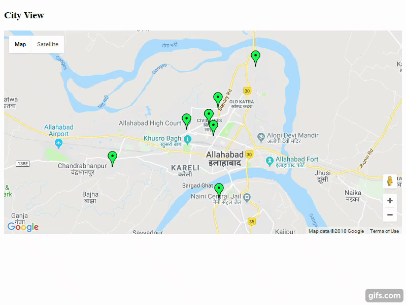

# Smart Policing System
-----------------------------    
The system aims to fulfill the following objectives:
* Overcome limitations of traditional surveillance techniques which require human vigilance.
* Increase effectiveness of law enforcement authority by providing comprehensive information about any activity to the nearest police control room, reducing response time as well in the process. 

 ### Installation & Getting Started
 ----------------------------------
There are three primary components:
	1. Central Server
	2. Client A (Surveillance site)
	3. Client B (Police Control Room)
Clone the repository and copy the folder corresponding to each component on the appointed system for that component.

*The installation instructions are for Windows 64-bit.*
**Dependencies common for all components:**
- **Anaconda** is higly recommended for handling python packages' dependencies
- Install all python packages from python_packages.txt in a new virtual environment.
    `pip -r install python_packages.txt`
#### 1. Central Server
_______________________

All communications in the system occur through this server. A simple web server
has been utilised for this purpose.A RESTful web service is made to run on the
server which responds to the request of all other clients.
**Dependencies to Install**
- **MySQL** : The database solution used. 

##### Setting Up:

1. Run all queries in file serverdb.sql to setup database tables.

##### Usage:

1. Run RequestHandler.py. 
*This will start a flask server on port 7777. 
    You should see the following output*
    
          Running on http://0.0.0.0:7777/ (Press CTRL+C to quit)

#### 2. Client A(Surveillance Site)
_______________________

Each site under surveillance will have a node of this type. It will receive video feed
from all CCTVs on this site. It will process the feed and pass an alert message the main server
of any suspicious activity detect along with *evidence* (image/video clip).

##### Usage:
1. Run client.py
2. The application will prompt for  server ip and port address
3. After a successful connection to the server, configuration settings must be done on the system    running the program. This needs to be done only on first run.
4. Provide CCTV information

#### 2. Client B(Police Control Room)
_______________________

**Note :** Proxifier is needed to be used for proxy authentication if you are behind a proxy to access the Internet. It is needed for communicating with google maps api.
##### Usage:

1. Run client.py
2. The application will prompt for  server ip and port address
3. After a successful connection to the server, configuration settings must be done on the system    running the program. This needs to be done only on first run.

* After the setup, GUI is provided in which all the clients are located in a map. Information of the can be known by 
clicking the site location on the map.

* Client B periodically probes server if it has received any messages from Client A. Once, any message is
received from particular site, the site location on the map turns red and alert is triggered.

* After the alert is triggered, site information can be known by clicking the site location on the map.

##### GUI - Complete System Monitoring

